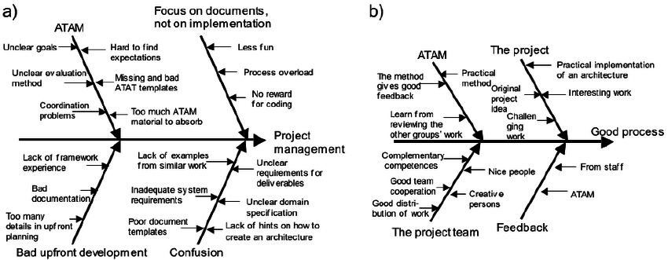

## 0x19. Postmortem

- Postmortem: Web Stack Outage

Issue Summary:
Duration: May 11, 2023, 9:00 AM - May 12, 2023, 1:00 PM (WAT)
Impact: The web application experienced intermittent downtime and slow response times, affecting all users. Approximately 90% of users were affected during peak hours.

Timeline:
- Issue Detected: May 11, 2023, 9:00 AM (WAT)
- Issue Detected By: Monitoring alerts triggered due to increased error rates and high latency.
- Actions Taken: The investigation started with analyzing the web server logs, database performance, and network connectivity. Initially, the assumption was that a recent code deployment could have caused the issue.
- Misleading Investigation Paths: The focus was initially on the code deployment, leading to the rollback of the latest release. However, the issue persisted even after the rollback, indicating a deeper problem.
- Escalation: The incident was escalated to the development team and the infrastructure team for further investigation and resolution.
- Incident Resolution: The root cause was identified and resolved by implementing a fix to the database configuration.

Root Cause and Resolution:
The root cause of the web stack outage was traced back to a misconfiguration in the database connection pool settings. Due to an increased number of concurrent connections, the database server was overwhelmed, causing slow response times and intermittent downtime. The default connection pool settings were insufficient to handle the sudden surge in user traffic.

To resolve the issue, the database connection pool settings were optimized based on the current traffic patterns and projected growth. The maximum number of connections allowed by the pool was increased, along with the tuning of connection timeouts and idle connection eviction policies. These changes ensured that the database server could handle the increased load efficiently.

Corrective and Preventative Measures:
1. Improve Monitoring: Enhance monitoring capabilities to proactively detect and alert on abnormal database connection pool behavior, such as high connection usage and increased latency.
2. Load Testing: Conduct regular load testing to simulate high traffic scenarios and validate the scalability of the web stack, including the database connection pool settings.
3. Automated Scaling: Implement an automated scaling mechanism that can dynamically adjust the database connection pool size based on the current traffic demands, ensuring optimal performance during peak usage.
4. Documentation and Training: Update the documentation to include best practices for configuring and tuning the database connection pool. Conduct training sessions for the development and infrastructure teams to raise awareness of potential bottlenecks and proper configuration.

Tasks to Address the Issue:
- Patch the web application to include enhanced monitoring for database connection pool metrics.
- Create a load testing plan and schedule regular tests to validate the scalability of the system.
- Implement an automated scaling solution for the database connection pool based on real-time traffic analysis.
- Update the documentation with detailed instructions for configuring and optimizing the database connection pool.
- Conduct training sessions for the development and infrastructure teams to ensure a thorough understanding of database connection pool best practices.

This postmortem highlights the impact, root cause, and resolution of a web stack outage that occurred due to a misconfiguration in the database connection pool settings. By implementing the recommended corrective and preventative measures, we aim to prevent similar issues in the future and ensure a more reliable and performant web application.
